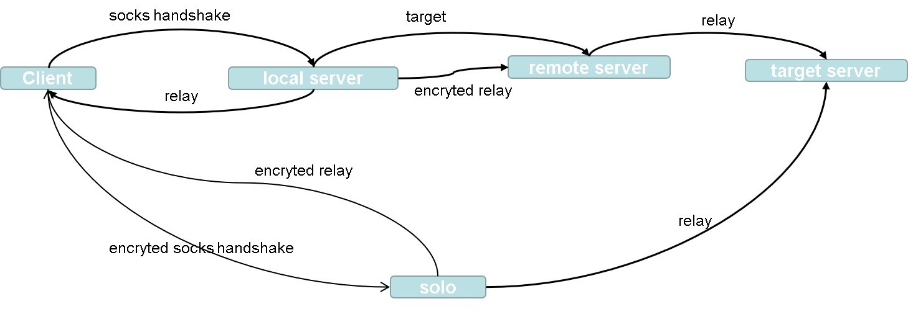

# go-proxy
A proxy program based on Go.

Step 1.
    communication.

Step 2.
    shadow.

How to shadow?
    shadow的功能就是将一个普通的Conn转化为具有加密/解密能力的Conn。
    而基本上所有的加密/解密算法的操作对象都是一个固定大小的数据块（末尾数据块会进行填充操作）
    所以，可以通过以下的方法实现一个具有加密解密功能的Conn: 将Conn获取的数据先放入缓存池进行解密再提交上层，将Conn要传送的数据先放入缓存池加密再进行传输
        为了方便复用与管理，我们将对读取数据和写入数据改为Writer与Reader
        所以Conn具有的模块应该包括：
            1. net.Conn, 负载数据传输
            2. Cipher, 加密算法
            3. Nonce(key),
            4. Writer,
            5. Reader,
        对于Writer, 我们在io.Writer上又对其做了一层封装, 它的属性有
            1. io.Writer
            2. Cipher,
            3. Nonce
            4. buf []
        对于Reader，也是一样的思路 
            1. io.Writer
            2. Cipher,
            3. Nonce 
            4. buf []
            
    所以下一步要做的，就是研究Cipher的使用，然后对Writer和Reader进行封装，最后再嵌入到Conn里面

hkdf: Package hkdf implements the HMAC-based Extract-and-Expand Key Derivation Function (HKDF) as defined in RFC 5869.
chachapoly1305: Package chacha20poly1305 implements the ChaCha20-Poly1305 AEAD and its extended nonce variant XChaCha20-Poly1305, as specified in RFC 8439 and draft-irtf-cfrg-xchacha-01.
Cipher的实现

## 结构图

